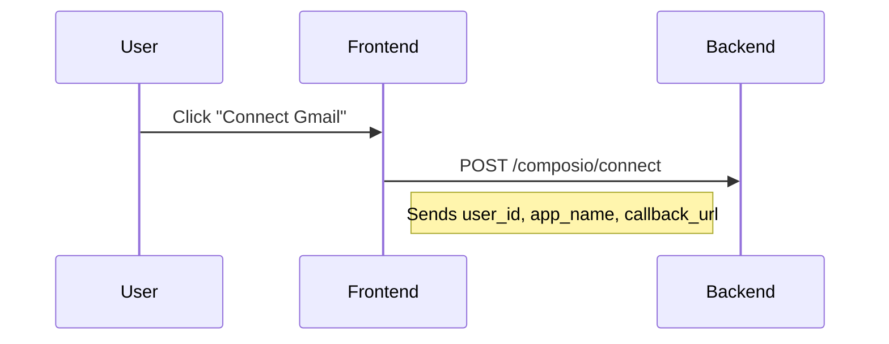
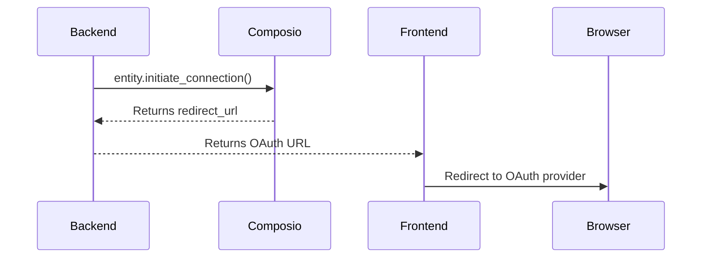
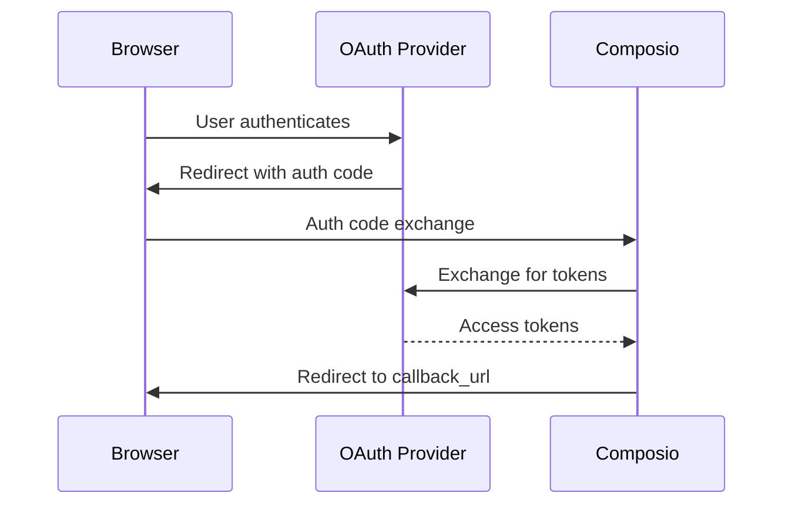
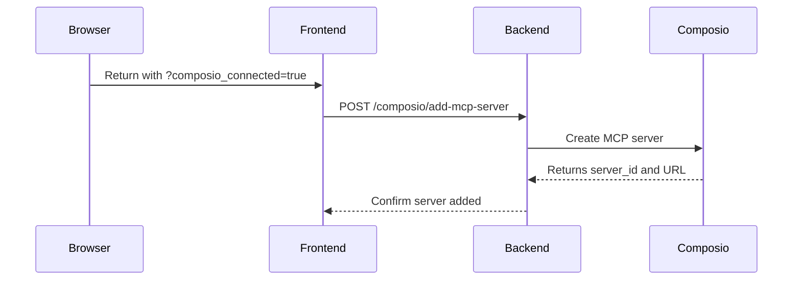
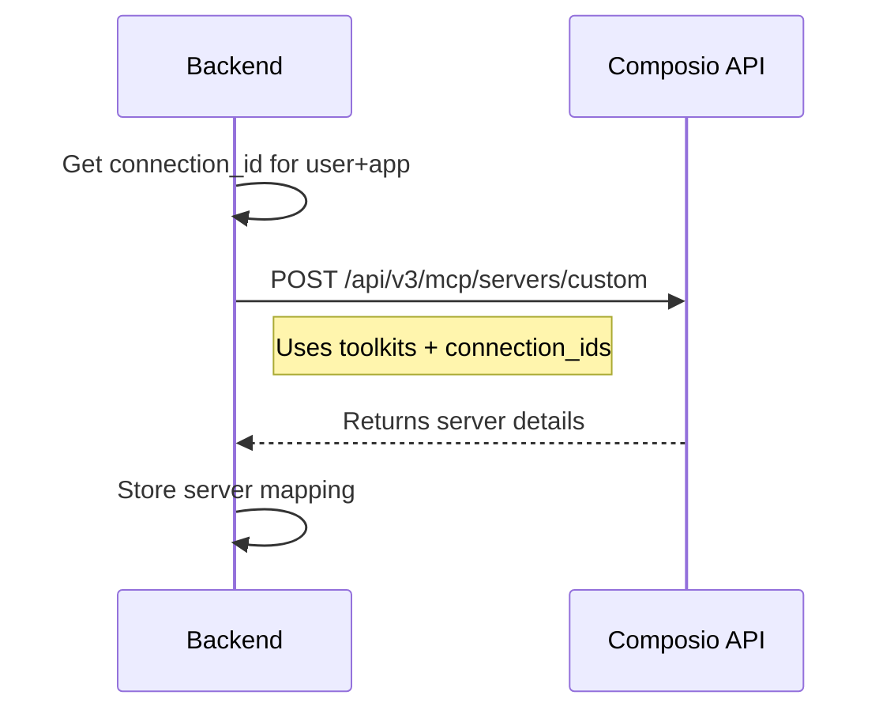
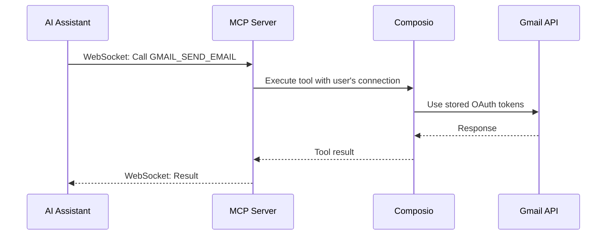

# Composio OAuth Flow and MCP Server Integration

## Overview

This document explains how the application integrates with Composio to provide OAuth authentication for external services (Gmail, GitHub, Slack, Notion) and exposes them as MCP (Model Context Protocol) servers for AI assistant access.

## Architecture Components

### 1. Frontend (React)
- **Component**: `ComposioOAuthFlow.tsx`
- **Purpose**: UI for connecting external services via OAuth
- **Features**: 
  - Shows available apps to connect
  - Initiates OAuth flow
  - Handles OAuth callback
  - Displays connection status

### 2. Backend (FastAPI)
- **Module**: `composio_integration.py`
- **Purpose**: Handles Composio SDK interactions
- **Key Class**: `ComposioIntegration`

### 3. External Services
- **Composio API**: OAuth provider and tool management
- **MCP Servers**: WebSocket servers exposing tools to AI

## OAuth Connection Flow

### Step 1: User Initiates Connection


**Frontend Code** (`ComposioOAuthFlow.tsx:92-102`):
```typescript
const response = await axios.post(`${API_BASE}/composio/connect`, {
  user_id: userId,
  app_name: appId,
  callback_url: `${window.location.origin}?composio_connected=true&app=${appId}`
})
```

### Step 2: Backend Initiates OAuth


**Backend Code** (`composio_integration.py:34-99`):
```python
async def initiate_connection(self, user_id: str, app_name: str, callback_url: Optional[str] = None):
    # Get or create entity for user
    entity = self.client.get_entity(id=user_id)
    
    # Optionally get auth config for specific OAuth settings
    auth_config_id = None
    try:
        # Try to get existing auth config
        auth_manager = AuthConfigManager(self.client)
        auth_configs = auth_manager.get(app=app_name.upper())
        if auth_configs and len(auth_configs) > 0:
            auth_config_id = auth_configs[0].id
    except Exception as e:
        logger.warning(f"Could not get auth config: {e}")
    
    # Initiate OAuth connection
    if auth_config_id:
        connection_request = entity.initiate_connection(
            app_name=app_name.upper(),
            redirect_url=callback_url,
            auth_config_id=auth_config_id
        )
    else:
        connection_request = entity.initiate_connection(
            app_name=app_name.upper(),
            redirect_url=callback_url
        )
    
    return {
        "redirect_url": connection_request.redirectUrl,
        "connection_id": connection_request.connectedAccountId,
        "user_id": user_id,
        "app": app_name
    }
```

### Step 3: OAuth Provider Authentication


This step happens entirely between the user's browser, the OAuth provider (e.g., Google for Gmail), and Composio's backend. The application doesn't handle tokens directly.

### Step 4: Handle OAuth Callback


**Frontend Code** (`ComposioOAuthFlow.tsx:40-49`):
```typescript
// Check if returning from OAuth callback
const urlParams = new URLSearchParams(window.location.search)
if (urlParams.get('composio_connected')) {
  const app = urlParams.get('app')
  if (app) {
    handlePostConnection(app)
  }
  // Clean up URL
  window.history.replaceState({}, '', window.location.pathname)
}
```

### Step 5: Create MCP Server


**Backend Code** (`composio_integration.py:337-495`):
```python
async def create_mcp_server(self, user_id: str, app_name: str):
    # Get the connection_id for this user and app
    connection_id = None
    connections = await self.get_user_connections(user_id)
    for conn in connections:
        if conn.get("app", "").lower() == app_name.lower():
            connection_id = conn.get("connection_id") or conn.get("id")
            break
    
    # Create unique server name
    import time
    timestamp = str(int(time.time()))[-6:]
    safe_name = f"{app_name}-{timestamp}-{user_id[:6]}".replace("_", "-")
    
    # Build request using the CORRECT format (toolkits + connection_ids)
    data = {
        "name": safe_name,
        "toolkits": [app_name.upper()],  # NOT "apps"!
        "entity_id": user_id,
    }
    
    if connection_id:
        data["connection_ids"] = [connection_id]  # Required for tools to work
    
    # Create MCP server via Composio API
    response = await client.post(
        "https://backend.composio.dev/api/v3/mcp/servers/custom",
        headers={"X-API-Key": self.api_key},
        json=data
    )
    
    # Return MCP WebSocket URL
    mcp_url = f"https://mcp.composio.dev/composio/server/{server_id}/mcp?user_id={user_id}"
    return {"server_id": server_id, "url": mcp_url}
```

## Critical Implementation Details

### 1. The Fix: toolkits vs apps
The key discovery that makes tools work properly:
- ❌ **BROKEN**: Using `apps` + `authConfigId` in the request
- ✅ **WORKING**: Using `toolkits` + `connection_ids` in the request

```python
# WRONG - Tools won't appear
data = {
    "apps": ["GMAIL"],
    "authConfigId": "ac_xxx",
    ...
}

# CORRECT - Tools will work
data = {
    "toolkits": ["GMAIL"],
    "connection_ids": ["conn_xxx"],
    ...
}
```

### 2. Connection ID is Critical
Without a `connection_id`, the MCP server will be created but won't have access to any tools. The connection ID links the MCP server to the user's OAuth tokens stored in Composio.

### 3. MCP URL Format
The MCP server URL must follow this exact format:
```
https://mcp.composio.dev/composio/server/{server_id}/mcp?user_id={user_id}
```

Note the `/mcp` path segment and `user_id` query parameter are both required.

## Data Flow for Tool Execution

Once connected, the AI assistant can use tools through the MCP server:



## Available Tools per Service

### Gmail
- `GMAIL_SEND_EMAIL` - Send emails
- `GMAIL_LIST_EMAILS` - List inbox emails
- `GMAIL_GET_EMAIL` - Get email details
- `GMAIL_REPLY_TO_EMAIL` - Reply to emails
- `GMAIL_CREATE_DRAFT` - Create draft emails
- `GMAIL_SEARCH_EMAILS` - Search emails
- And 14 more...

### GitHub
- `GITHUB_CREATE_ISSUE` - Create issues
- `GITHUB_CREATE_PULL_REQUEST` - Create PRs
- `GITHUB_GET_REPOSITORY` - Get repo info
- `GITHUB_LIST_REPOSITORIES` - List repos
- And many more...

### Slack
- `SLACK_SEND_MESSAGE` - Send messages
- `SLACK_LIST_CHANNELS` - List channels
- `SLACK_GET_CHANNEL` - Get channel info
- And more...

### Notion
- `NOTION_CREATE_PAGE` - Create pages
- `NOTION_UPDATE_PAGE` - Update pages
- `NOTION_QUERY_DATABASE` - Query databases
- And more...

## Server Storage and Management

### Backend Storage
```python
# Server mappings stored in memory (should use persistent storage in production)
mcp_server_mappings = {
    "user_123:gmail": "server_uuid_abc",
    "user_123:github": "server_uuid_def"
}

# Remote MCP servers for WebSocket connections
remote_mcp_servers = {
    "composio-gmail": {
        "url": "wss://mcp.composio.dev/composio/server/uuid/mcp?user_id=123",
        "name": "Gmail Tools",
        "connected": True
    }
}
```

### Avoiding Duplicates
The system checks for existing server mappings before creating new ones:
```python
mapping_key = f"{user_id}:{app_name}"
if mapping_key in mcp_server_mappings:
    # Use existing server
    server_uuid = mcp_server_mappings[mapping_key]
else:
    # Create new server
    server_info = await composio.create_mcp_server(user_id, app_name)
```

## Error Handling

### Common Issues and Solutions

1. **No tools appearing in MCP server**
   - Cause: Using wrong API format (apps instead of toolkits)
   - Solution: Use `toolkits` + `connection_ids`

2. **OAuth callback not handled**
   - Cause: Callback URL mismatch
   - Solution: Ensure callback URL matches exactly

3. **Connection exists but tools don't work**
   - Cause: Missing connection_id in MCP server creation
   - Solution: Always include connection_ids array

4. **Server creation fails with 403**
   - Cause: Server with same name already exists
   - Solution: Use unique names with timestamps

## Security Considerations

1. **Token Storage**: OAuth tokens are stored by Composio, not in the application
2. **User Isolation**: Each user has their own entity ID and connections
3. **API Key Protection**: Composio API key should be kept server-side only
4. **Connection Validation**: Always verify user owns the connection before creating MCP servers

## Testing the Flow

### Manual Testing Steps
1. Click on an app (e.g., Gmail) in the UI
2. Complete OAuth authentication
3. Verify connection appears as "connected" in UI
4. Check backend logs for successful MCP server creation
5. Verify tools are accessible through the MCP server

### Debugging Commands
```bash
# Check if MCP server is responding
curl -i "https://mcp.composio.dev/composio/server/{server_id}/mcp?user_id={user_id}"

# List user's connections via API
curl -H "X-API-Key: $COMPOSIO_API_KEY" \
  "https://backend.composio.dev/api/v1/entities/{user_id}/connections"
```

## Future Improvements

1. **Persistent Storage**: Move from in-memory to database storage for server mappings
2. **Connection Refresh**: Implement token refresh handling
3. **Error Recovery**: Add retry logic for failed MCP server creation
4. **Bulk Operations**: Support connecting multiple apps at once
5. **Connection Management UI**: Add ability to disconnect/reconnect apps
6. **Health Checks**: Monitor MCP server availability

## References

- [Composio Documentation](https://docs.composio.dev)
- [MCP Protocol Specification](https://modelcontextprotocol.io)
- [Composio MCP Integration](https://mcp.composio.dev/composio)